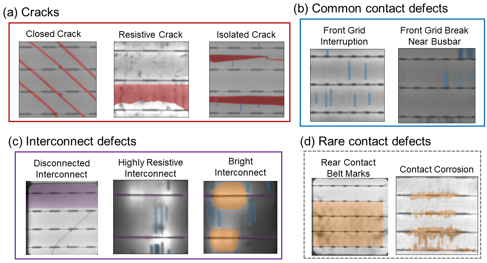
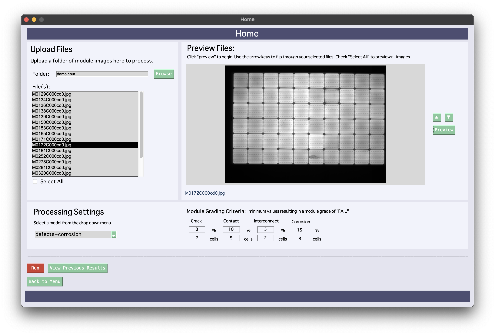

# BetterSolarUI 0.1.0
Initial release of the Better Solar User Interface for American Made Solar Prize Round 5: Software Track SET! stage.

## Our Goals
* _Automate_ image interpretation and provide valuable statistics.
* Create a _user-friendly_ experience for a historically time-consuming image processing practice. 
* Provide an _all-in-one_ system that can be _tailored_ to fit a consumer's needs.


## What Does our Application Do?
In the solar industry there is a consistent influx of valuable Electroluminescence (EL) images, which become 
overwhelming and unmanagable. Inspecting these images easily becomes a tedious and monotonous process.

The Better Solar approach relies on a supervised Machine Learning (ML) approach that has been proven to effectively 
detect, localize, and classify numerous defects that can originate in manufacturing, during accelerated aging tests, 
or following field exposure. 

At this point, the software can effectively provide granular output with defect detection and localization of 
the various defects shown below. This output allows for further analysis on 
defect impact on module outputs, valuable to the customer. Eventually, our solution will provide this feedback on 
the magnitude of the problem (e.g., its impact on energy yield) and provide suggested corrective actions both in 
a manufacturing or a field-based setting.


_* The colors and groupings of defects in the application are consistent with this figure. Cracks are grouped into
a red category, contact defects are labeled blue, interconnect failures are purple, and the brightspots and corrosion
are both in yellow (shown in different model selections)_

## Table of Contents:
* [Basic System Workflow](#Basic-System-Workflow)
* [Interface Screenshots](#Interface-Screenshots)
* [User Guide](#User-Guide)
  * [Installation](#Installation)
  * [Run Software](#Run-Software)
* [Release History](#Release-History)
* [Notable Future Plans](#Notable-Future-Plans)
* [Contact Us](#Contact-Us)

### Basic System Workflow
1. Upload **module** files and select custom processing settings on UI. (*See: 'Screenshots: Home Page Window'*)
2. Module files are fed into image preprocessing algorithm. Modules are split into individual cells.
3. Cell files processed with our ML cell level analysis and defect detection algorithms.
4. Analysis and defect detection results collected and outputted, allowed for display and viewing. (*See: 'Screenshots: Results Window'*)

### Interface Screenshots

#### Home Page Window:
#### Results Window:
#### Image Review Window:

## User Guide
(For initial 0.1.0 Release of BetterSolarUI)

### Installation
_* (installation has been tested on Python 3.7 and up on Windows, Linux, and MacOSX)_

To run this project, install it locally on your machine. Use:
* Using GitHub CLI:
```sh 
gh repo clone bettersolar/BetterSolarUI
```
* Using git in terminal/command line:
```sh
git clone https://github.com/bettersolar/BetterSolarUI.git
```
* Using python IDE w/ integrated source control/git support:
  * Find git clone support, paste ``` https://github.com/bettersolar/BetterSolarUI.git ```
 
Requires python environment to run. Example environment setup instructions: https://docs.anaconda.com/anaconda/install/index.html

IMPORTANT NOTE: if using an Anaconda environment, this must be ran before the requirements.txt file (dependency issues):
```sh
conda install -c conda-forge pyhull
```
_* there still seems to be an issue with this package using Anaconda on Windows. Please reach out if you have trouble getting an environment
set up_

Using the included `requirements.txt` file, use terminal to easily install dependencies onto your dedicated environment with:
```sh
pip install -r requirements.txt
```


### Run Software
```sh
python3 interface.py
```

Folder Structure:
```
BetterSolarUI
  - demoinput\
  - demoout\
  - models\
  - images\
  ...
  [ interface.py, process_cells.py, etc]
```
* Input files placed in: `demoinput`
  * Further example input found in `demoinput`. 
* Cell-cut modules outputted in: `images`
  * Pre-cut cell images may be used, just place them in `images\{module_name}\`, they will not get overwritten
* Processed files outputted in `demoout`
  * Once images are processed and run through our algorithms, they are _automatically_ populated here.
  * `demoout` folder contains folder(s) of processed module(s). 
* Defect Detection models placed in`models` 
  * Currently two models are avaliable for selection via the UI:
    * `defect+brightspot.pth`: cracks, contact interruptions, resistive interconnect defects and highlights _interconnect brightspots_.
    * `defect+corrosion.pth`: cracks, contact interruptions, resistive interconnect defects and _contact corrosion_.


## Release History
* 0.1.0
  * Initial Release for SET! Submission of American Made Solar Prize Round 5: Software Track SET!

## Notable Future Plans
* Automated Detection of Module Size (e.g. 6x10, 60 cell) 
* Various Bit Depth Imagery Accomodation
* Include Additional Defect Types and Grading Criteria
* Expand Image Preprocessing to include:
  * Lens distortion (e.g. Fisheye Distortion)
  * Intensity Normalization
  * Background corrections
  
## Contact Us
Email us at _contact@bettersolargroup.com_. 


