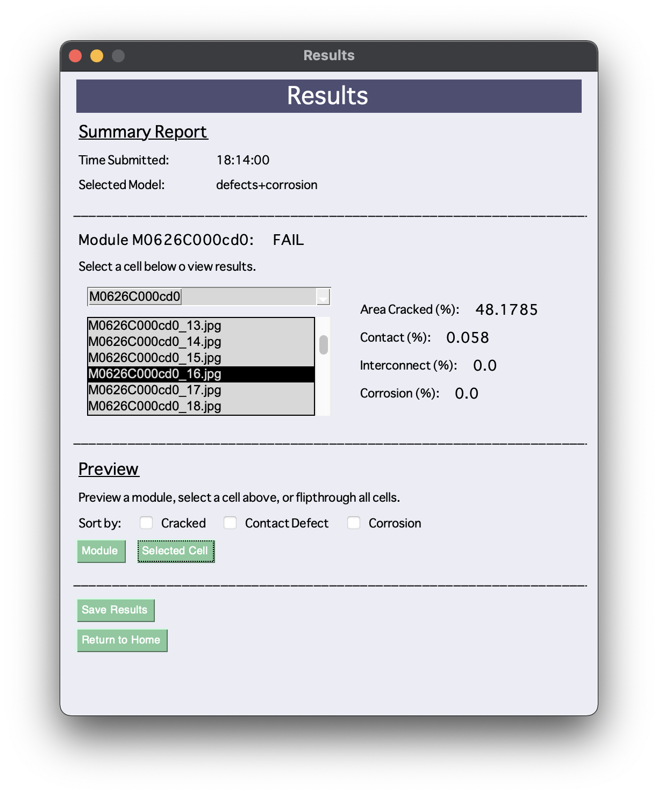
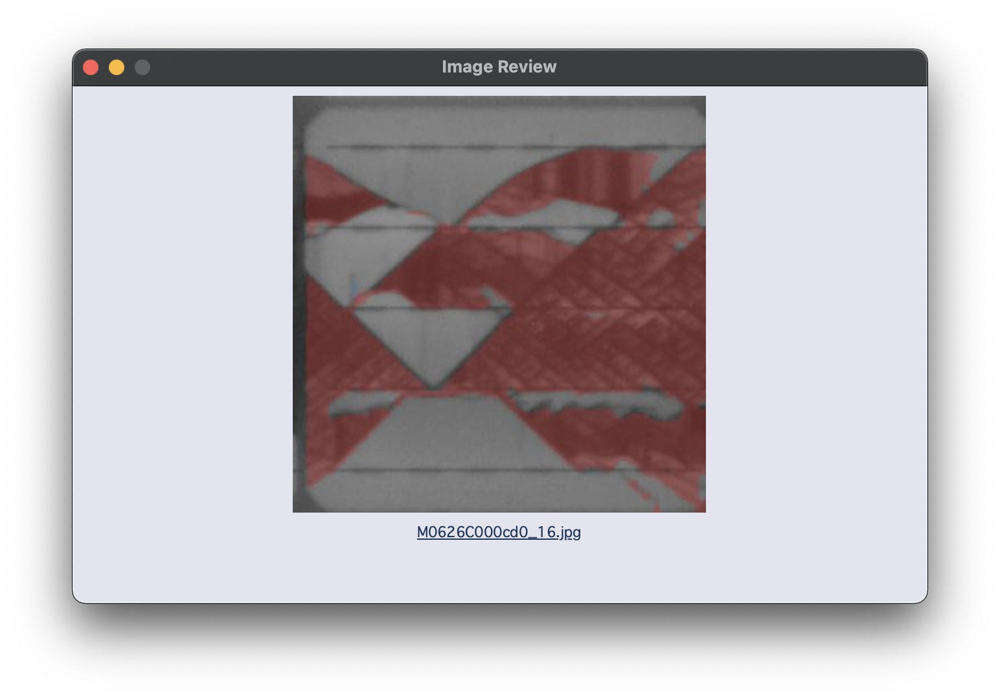
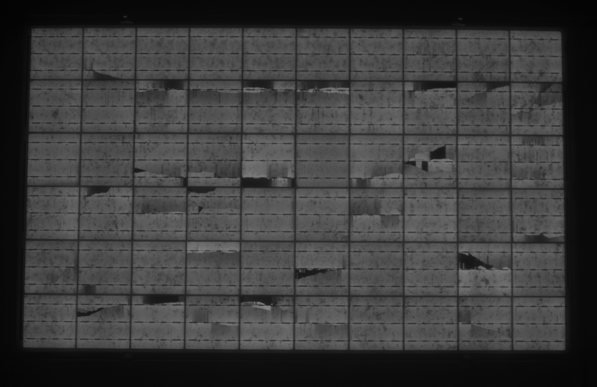
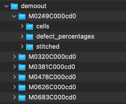

# BetterSolarUI 0.1.0
Initial release of the Better Solar User Interface for American Made Solar Challenge Round 5: Software Track Semifinals.

## Our Goals
* _Automate_ image interpretation and provide valuable statistics.
* Create a _user-friendly_ experience for a historically time-consuming image processing practice. 
* Provide an _all-in-one_ system that can be _tailored_ to fit a consumer's needs.


## What Does our Application Do?
In the solar industry there is a consistent influx of valuable Electroluminescence (EL) images, which become 
overwhelming and unmanagable. Inspecting these images easily becomes a tedious and monotonous process.

The Better Solar approach relies on a supervised Machine Learning (ML) approach that has been proven to effectively 
detect, localize, and classify numerous defects that can originate in manufacturing, during accelerated aging tests, 
or following field exposure. 

At this point, the software can effectively provide granular output with defect detection and localization of 
the various defects shown below. (*See: 'Screenshots: Defect Types'*) This output allows for further analysis on 
defect impact on module outputs, valuable to the customer. Eventually, our solution will provide this feedback on 
the magnitude of the problem (e.g., its impact on energy yield) and provide suggested corrective actions both in 
a manufacturing or a field-based setting.


### Basic System Workflow
1. Upload **module** files and select custom processing settings on UI. (*See: 'Screenshots: Home Page Window'*)
2. Module files are fed into image preprocessing algorithm. Modules are split into individual cells.
3. Cell files processed with our ML cell level analysis and defect detection algorithms.
4. Analysis and defect detection results collected and outputted, allowed for display and viewing. (*See: 'Screenshots: Results Window'*)

### Screenshots

#### Defect Types:
#### Home Page Window:
#### Results Window:
#### Image Review Window:


## Installation

Download ZIP folder above or use `gh repo clone mhalbert/BetterSolarUI`    (TODO! update for new repo!!!!!)

Using the above`requirements.txt` file, use terminal to easily install dependencies onto your dedicated environment with:
`pip install -r requirements.txt`


## User Guide
(For initial 0.1.0 Release of BetterSolarUI)

Folder Structure:
```
BetterSolarUI
  - demoinput\
  - demoout\
  - models\
  - images\
  ...
  [ interface.py, process_cells.py, etc]
```
* Input files placed in: `demoinput`
  * Further example input found in `demoinput`. 
* Cell-cut modules outputted in: `images`
  * Pre-cut cell images may be used, just place them in `images\{module_name}\`, they will not get overwritten
* Processed files outputted in `demoout`
  * Once images are processed and run through our algorithms, they are _automatically_ populated here.
  * `demoout` folder contains folder(s) of processed module(s). 
* Defect Detection models placed in`models` 
  * These models are avaliable for selection via the UI.
  * The current available models both find cracks, contact interruptions, and resistive interconnect defects. 
  * One of the models also finds contact corrosion, and the other highlights interconnect brightspots.


## Release History
* 0.1.0
  * Initial Release for SET! Submission of American Made Solar Challenge Round 5: Software Track

## License

## Contact Us
Email us at _contact@bettersolargroup.com_. 


